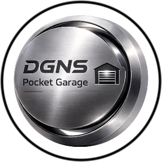

<h1 align="center">DGNS Pocket Garage</h1>

<p align="center">
  
</p>

<p align="center">
  <em>
    An open-source AR vehicle scanner Lens for Snap Spectacles, allowing users to scan real vehicles,
    generate collectible cards, level up, and sync their garage in the cloud.
  </em>
</p>

<p align="center">
  
</p>

---

## Overview

**DGNS Pocket Garage** is an open-source Lens project designed for **Snap Spectacles**.  
It provides a complete gameplay loop to scan vehicles in the real world, generate collectible cards, build a persistent AR garage around yout wrist and trade cards with other players 
in collocated connected lens session.

The project is intended as:
- a **technical reference**
- a **creative playground**
- and a **starting point** for custom Spectacles spotting/collecting/gameified experiences

Users are responsible for respectful and lawful use of scanned content and cloud features.

---

## Features

- **AI Vehicle Scanning**  
  Capture and identify real vehicles, then generate a rich vehicle card.

- **Collectible Card System**  
  Save scanned cars, manage rarity, browse your collection, and visualize cards in AR.

- **XP / Progression**  
  Earn XP, level up, prestige, and track streak/progression metrics.

- **Cloud Sync (Supabase + Snap Cloud)**  
  Sync profiles, collection data, leaderboard stats, card images, and sharing features.

- **Connected Lens Multiplayer**  
  Start shared sessions, synchronize interactions, and exchange cards with other players.

- **Narration + UI Feedback**  
  Includes dynamic text narration, status messages, and immersive SFX flow.

---

## Requirements

- **Lens Studio** 
- **Snap Spectacles** device for deployment/testing
- Internet access for cloud and multiplayer features
- Valid Snap Cloud / Supabase configuration for online features

---

## Installation

```bash
git clone https://github.com/DgnsGui/DGNS-Pocket-Garage.git
```

Open the project file in Lens Studio:

```bash
DGNS Vehicle Scanner - SNAPCLOUD.esproj
```

<p align="center">
  Developed with ❤️ by GuillaumeDGNS
</p>
